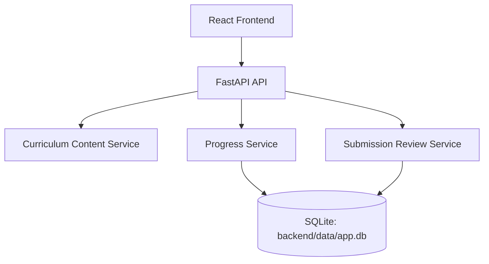

# AI Training Studio Architecture Reference

## 1. Project Overview

### Purpose
Build and run a single interactive application that serves both:

- a 6-week student AI enablement program
- a practical teacher workshop focused on classroom use of AI

### Active Runtime Curriculum

- Week 1: AI Foundations and AI Literacy
- Week 2: Prompt Engineering and AI for Learning
- Week 3: Data Thinking and Machine Learning Basics
- Week 4: Python, Automation, and Computational Thinking
- Week 5: RAG, MCP, and AI-Powered Systems
- Week 6: Capstone Development and AI Showcase
- Teacher Workshop: AI for Teachers: Practical Classroom Planning Workshop

### Product Positioning

- one tutor-centric interactive workspace
- concept-wise learning structure
- visible class activities, reflections, assignments, image placeholders, and teacher demo walkthroughs
- future-ready placeholders for diagrams, images, GIFs, and simulations

### Technical Constraint

- embedded SQLite only
- database path: `backend/data/app.db`
- no separate database server

---

## 2. Technology Stack

| Layer | Current Choice | Notes |
|---|---|---|
| Frontend | React + TypeScript + Vite | Existing interactive UI |
| Backend | FastAPI | Serves API and built frontend |
| Database | SQLite | Embedded inside project |
| ORM | SQLAlchemy | Current persistence layer |
| Migrations | Alembic | Current migration tooling |
| Verification | Manual launch and build verification | Automated test suite removed from the repo |
| Content Source | Structured runtime content + manifest | Served through backend content services |

---

## 3. Application Architecture



### Runtime Characteristics

- FastAPI serves the built frontend at `/`
- API endpoints stay under `/api/...`
- the curriculum is delivered as 6 active student weeks plus 1 teacher workshop entry
- UI layout, routing, styling, and navigation are shared across the student and teacher tracks

---

## 4. Curriculum Content Model

Each active runtime item uses the same base structure:

- overview
- lesson
- curriculum
- activity
- quiz
- reflection

Teacher track note:

- the teacher workshop still carries a quiz object in content for compatibility, but the live page flow intentionally skips rendering the quiz panel

### `curriculum` Shape

Each week curriculum contains:

- overview
- concepts
- visual gallery
- activities
- assignments

The runtime API now omits the older lecture-note, instructor-note, and tutor-note sections so the shipped model matches the live interface.

### Concept Structure

Each concept is organized concept-wise for future visuals:

- title
- definition
- why it matters
- real-world use case
- practical examples
- common mistakes
- best practices

---

## 5. Active 6-Week Curriculum Breakdown

## Teacher Workshop Track

### Focus
Help non-technical teachers use AI practically for lesson planning, assessment, differentiation, classroom activity design, student support, productivity, and responsible AI review.

### Current Experience
- stronger concept explorer sequence for teachers
- one live prefilled teaching demo based on `Photosynthesis`
- presenter guide for what is happening, what is shown, and what comes next
- prompt library and practical guidance panels
- no teacher quiz panel in the live UI

## Week 1: AI Foundations and AI Literacy

### Focus
Understand what AI is, where it is used, what it can and cannot do, and how to think critically about AI output.

### Core Topics
- Artificial Intelligence
- Machine Learning
- Data Science
- Generative AI
- Deep Learning
- Narrow AI vs General AI
- Neural Networks
- Multimodal and document AI basics
- AI strengths and limitations
- Hallucinations
- Bias
- Responsible AI

## Week 2: Prompt Engineering and AI for Learning

### Focus
Use prompts, structure, examples, constraints, and verification to make AI more useful for study and learning.

### Core Topics
- prompts
- role prompting
- context
- output format
- constraints
- examples
- iteration
- verification
- tokens
- context windows
- inference
- next-token generation
- attention and sampling controls
- temperature
- top-p
- top-k
- AI as tutor
- AI as writing and study assistant

## Week 3: Data Thinking and Machine Learning Basics

### Focus
Understand how AI systems depend on data, how simple prediction works, and why weak or biased data creates weak AI results.

### Core Topics
- data
- datasets
- features
- labels
- training data
- testing data
- classification
- prediction
- regression
- recommendations
- bias
- overfitting
- neural-network foundations

## Week 4: Python, Automation, and Computational Thinking

### Focus
Learn the programming basics needed to understand logic, automation, and simple AI-enabled workflows.

### Core Topics
- computational thinking
- decomposition
- variables
- conditions
- loops
- functions
- lists
- simple automation
- rule-based chatbot logic
- open-source models
- local inference
- Ollama
- running a local model

## Week 5: RAG, MCP, and AI-Powered Systems

### Focus
Understand how modern AI systems use retrieval, tools, resources, prompts, APIs, and external systems.

### Core Topics
- retrieval
- semantic search
- embeddings
- vector databases
- chunking
- reranking
- citations
- source freshness
- RAG
- RAG vs fine-tuning
- knowledge bases
- MCP
- tools
- resources
- prompts
- APIs
- agents
- agents vs chatbots
- AI agents understanding
- frontier models
- open-source vs hosted model choice
- MoE
- LLM parameters
- AI cost

## Week 6: Capstone Development and AI Showcase

### Focus
Apply the full program in an AI-enabled capstone project with prompts, workflows, knowledge use, tools, and responsible AI thinking.

### Core Topics
- problem statement
- target users
- AI workflow
- prompt design
- data or knowledge source
- RAG idea
- MCP/tool idea
- model choice
- inference cost
- frontier vs open-source tradeoff
- safety and ethics
- testing
- presentation

---

## 6. Navigation and UX Structure

### Current Navigation

- dashboard
- week pages
- teacher workshop page

### Week Page Sections

- overview
- concepts
- images
- class activities
- assignments
- checkpoint quiz
- reflection

Teacher page behavior:

- uses the same core layout and routing pattern
- skips the quiz panel
- uses the activity studio as the main live workshop demonstration surface
- currently exposes one presenter-friendly live demo instead of multiple teacher demos

### UX Direction Already Implemented

- tutor-centric workspace
- premium visual styling
- concept accordions
- concept-level image and GIF placeholders
- separate week-level visual gallery in the sidebar
- visible activity studio
- launch-activity placeholder pattern
- quiz completion validation, retry flow, and click-to-reveal quiz answers
- unified app launch
- teacher sidebar and dashboard grouping
- single live teacher demo player with presenter guide

---

## 7. Folder Structure

```text
frontend/
backend/
content/
docs/
```

### Relevant Paths

- `backend/main.py`: unified launcher
- `backend/app/services/content_loader.py`: content loading
- `backend/app/services/curriculum_transformers.py`: active 6-week curriculum source
- `frontend/src/components/TeacherDemoPlayer.tsx`: teacher live demo presenter module
- `backend/data/app.db`: embedded SQLite database
- `content/course-manifest.json`: active week manifest
- `docs/IMPLEMENTATION-CHECKLIST.md`: handoff status

---

## 8. Verification Status

### Verified

- frontend build passes
- active manifest returns 6 student weeks plus 1 teacher workshop
- unified launch serves the frontend from FastAPI

### Handoff Rule

For the next session:

1. Read `docs/IMPLEMENTATION-CHECKLIST.md`
2. Read `docs/AI-Training-Interactive-App-Architecture.md`
3. Continue from the next real enhancement task

---

## 9. Future Enhancements

- richer interactive activity widgets
- more visual media and diagrams
- content authoring workflow
- stronger analytics and reporting
- authentication beyond demo mode
- CI for build and migration checks

## 10. Current Content Expansion Notes

The active 6-week runtime curriculum now explicitly includes:

- neural networks
- regression in machine learning
- tokens and context windows
- inference and next-token generation
- attention-related sampling controls: `temperature`, `top-p`, and `top-k`
- embeddings and vector databases
- chunking, reranking, citations, and source freshness
- RAG vs fine-tuning
- agents vs chatbots
- AI agents understanding
- multimodal AI, OCR, and document AI workflows
- open-source models and frontier models
- Ollama and local model execution
- LLM parameters and MoE
- AI cost and deployment tradeoffs

Current class-activity additions include:

- designing a filesystem-based RAG in class
- discussing and demonstrating local open-source model execution with Ollama
